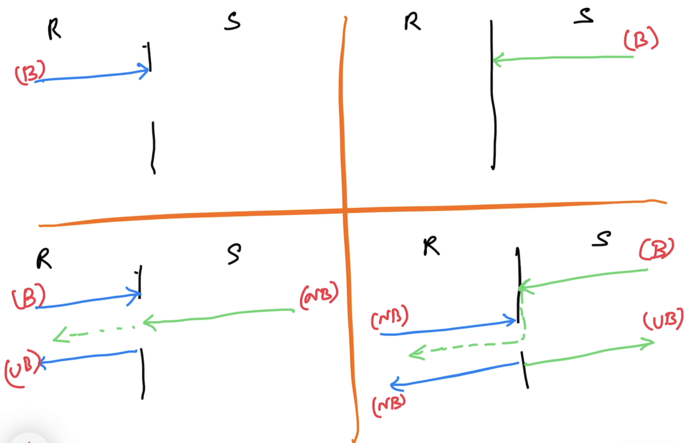

# Intermediate Go

## Magesh Kuppan
- tkmagesh77@gmail.com
- http://linkedin.com/in/tkmagesh

## Schedule
| What | When |
|----|---|
| Commence | 9:30 AM |
| Tea Break  | 11:00 AM (20 mins) |
| Lunch Break | 12:30 PM (1 hr) |
| Tea Break | 3:00 PM (20 mins) |
| Wind up | 4:30 PM |

## Software Requirements
- Go Tools (https://go.dev/dl)
- Visual Studio Code (https://code.visualstudio.com)

## Repository
- https://github.com/tkmagesh/nutanix-gointermediate-apr-2025

## Course Outline
- in the repo

## Methodology
- No powerpoint
- Discuss & Code
- Floor is open at all times for Q&A

## Prerequisites
- Data Types
- Language Constructs
    - Variables, Constants, iota
    - if else, for
    - functions
        - variadic functions
        - anonymous functions
        - higher order functions
        - deferred functions
    - error handling
    - panic & recovery
    - modules & packages
    - OOP
        - structs (methods)
        - interfaces

## Concurrency in Go

### Concurrency Programming
- Application is designed to have more than one execution path

### Managed Concurrency
- Builtin Scheduler
- Concurrent operations are represented as "goroutines"
- goroutines are cheap (~2KB)
- goroutines are scheduled by the scheduler to be executed by the OS threads
- Go scheduler uses both "cooperative" & "preemptive" strategies

### Language support
- Support for concurrency is built in the language itself
- "go" keyword, "chan" data type, "<-" operator, "range" & "select-case" constructs
- sdk support
    - "sync" package
    - "sync/atomic" package

### sync.WaitGroup
- semaphore based counter
- Can block the execution of a function until the counter becomes 0

### Data Race
```shell
go run --race 05-demo.go
```

```shell
go build --race -o 05-demo-wrd 05-demo.go
```

### Channels
- data type designed to enable communication between goroutines
- use the channel operator (<-) to send & receive data through the channel

#### Declaration
```go
var ch chan int
```

#### Initialization
```go
ch = make(chan int)
```

#### Declaration & Initialization
```go
var ch chan int = make(chan int)
// OR
var ch = make(chan int)
// OR
ch := make(chan int)
```

#### Communication
##### Send operation
```go
ch <- 100
```
##### Receive operation
```go
data := <- ch
```
#### Channel Behavior


## Context
- Initially designed for simplifying "cancel propagation"
- Has the ability to create a "hierarchy" of contexts
- Further enhanced to share data among hierarchy of goroutines
- A context object implements `context.Context` interface
    - Done() 
        - returns a channel through which the cancel signal is received
### Creation
- context.Background()
    - meant to create a root context
    - non-cancellable
- context.WithCancel()
    - expects a parent context to be passed
    - returns a `cancel()` to send the cancel signal
- context.WithTimeout() & context.WithDeadline()
    - time based cancellation (automatic)
    - also allows programmatic cancellation
- context.WithValue()
    - meant to share data across context hierarchy
    - non-cancellable